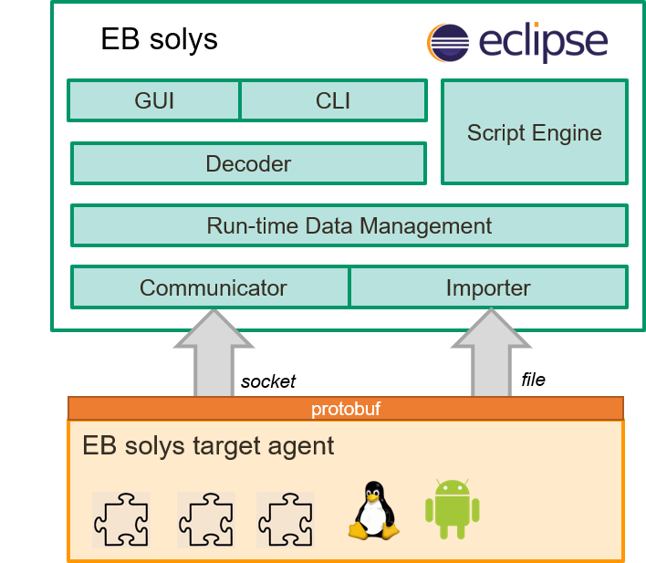

# EB solys

EB solys is

* a development tool for collecting, aggregating and correlating data and its visualization. Live and post-mortem.
* a framework to be customized and extended for the best possible integration with the project it's used in.
* a method to identify and localize functional and non-functional defects in an early phase for reducing the efforts spent for testing and bug fixing in later phases.
* a sophisticated approach to analyzing and validating complex automotive software systems from top to bottom.

## High level architecture

The EB solys eco-system consists of the target agent for collecting run-time data on the target system and an Eclipse RCP based analysis tool-chain running on the host environment.



The target agent is running on the target device(s) and serves as a plug-in framework. The plug-ins are used to acquire any kind of runtime data, such as resource consumption, application logs & traces, interprocess-communiction, I/O, etc. 
There is a set of  target agent plug-ins available, but you can implement your own plug-in, that retrieves additional proprietary project specific data. The data is sent to the host in a unified way, specified with protobuf.  

The target agent framework is available as open source project for 
* Linux (see https://github.com/Elektrobit/eb-solys-target-agent) and 
* Android (see https://github.com/Elektrobit/eb-solys-android-agent).

The EB solys GUI is built on Eclipse RCP and is running on the host machine and allows an expressive and comprehensive system analysis by correlating and aggregating the collected runtime data. 
The host application provides extensible means for data analysis. 
It is equipped with a rich set of visualizations tools like charts, tables and a communication graph out of the box and can be extended through custom HTML visualizations. 
In addition you can provide your own importer and decoder for any kind of logs, which are not created originally by the target agent.

## Build

### Prerequisites

* Latest eclipse for plugin development installed
* Java 8 or higher
* Maven 3.3.1

### Build GUI Executable

```
cd src/com.elektrobit.ebrace.releng.ui.ecl.aggregator
mvn clean verify
```

## Contact

EB solys development is supported by systemticks GmbH.
For further questions on how to build, contribute or use, please reach out to

eb-solys@systemticks.de

## License and Copyright

Copyright (C) 2018 Elektrobit Automotive GmbH

This program and the accompanying materials are made
available under the terms of the Eclipse Public License 2.0
which is available at https://www.eclipse.org/legal/epl-2.0/
