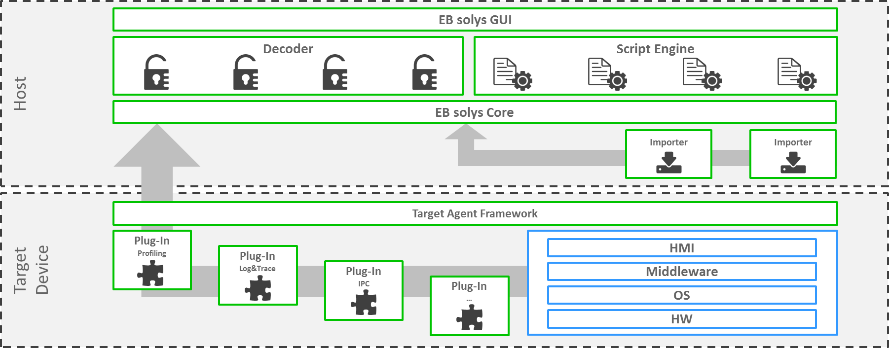

////
Copyright (C) 2018 Elektrobit Automotive GmbH

This program and the accompanying materials are made
available under the terms of the Eclipse Public License 2.0
which is available at https://www.eclipse.org/legal/epl-2.0/

SPDX-License-Identifier: EPL-2.0
////
=== Introduction to {solys}

{solys} is a development and testing tool for collecting, aggregating and correlating data
and its visualization. Live and post-mortem. It is a framework that can be customized
and extended for the best possible integration with the project it's used in.

With its methods you are able to identify and localize functional and non-functional
defects of your software system in an early phase for reducing the efforts spent for testing and bug fixing in later phases.

[[anchor-eco_system]]
==== The eco system

{solys} consists of the {targetagent}, collecting data on the target system
machine and an Eclipse RCP based analysis tool-chain running on the host environment.

The {targetagent} is the gateway to the host and provides a plug-in framework that
allows an easy integration of new data collectors if required.

Following diagram shows the eco system of a typcial system environment where {solys} is used:

===== The target device

It contains the software system, that should be monitored and analyzed.
It can be a physical or logical unit or a composition of multiple units
(e.g. an Android smartphone, a complete IVI stack, a web-service, etc.)

===== The {solys} {targetagent}

The {solys} {targetagent} is running on the target device(s) and serves as a plug-in framework.
The plug-ins are used to acquire any kind of runtime data, such as resource
consumption, application logs & traces, interprocess-communiction, I/O, etc.
The data is sent to the host in a unified way.
{solys} is shipped with a set of available {targetagent} plug-ins,
but you can implement your own plug-in, that retrieves additional proprietary
project specific data.

The {targetagent} framework is available for Linux, QNX, Windows and Android.

===== The {solys} GUI

The {solys} GUI is running on the host machine and allows an expressive and
comprehensive system analysis by correlating and aggregating the collected
runtime data.
The host application provides extendable means for data analysis. It is equipped
with a rich set of visualizations tools like charts, tables and a communication graph out of
the box and can be extended through custom HTML visualizations.
In addition you can provide your own importer and decoder for any kind of logs,
which are not created originally by the {targetagent}.
