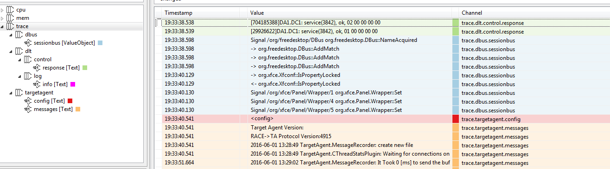

////
Copyright (C) 2018 Elektrobit Automotive GmbH

This program and the accompanying materials are made
available under the terms of the Eclipse Public License 2.0
which is available at https://www.eclipse.org/legal/epl-2.0/

SPDX-License-Identifier: EPL-2.0
////
=== Events and Channels

If not yet done please have a look at the
<<./index.adoc#anchor-eco_system, eco system>> of {solys} to
understand the data flow between the {targetagent} and the host tool. Data are either provided
by a {targetagent} plug-in or by an importer. A single data is called an *event* and
the collection of same kind of events in a container is called a *channel*.

[[anchor-events]]
==== Events

Events carry the basic runtime information of your system. An event can be any kind of sampled data at a certain timestamp, such as a cpu load sample of a thread, memory consumption of a process, ipc messages, trace and logging data, etc.
An event always comes with a timestamp, a unit (e.g. Text, Bytes, Count, Percent) and a value, whereas the value can be of primitive type or of any arbitrary complex type.
Events can either be acquired from a {targetagent} plug-in and sent to {solys} or created by an importer directly inside {solys} and are collected in containers, so-called <<anchor-channels, channels>>.
Complex types can be transformed into structured trees by a corresponding decoder.
Events can also be accessed and created by using the internal Script API.

[[anchor-channels]]
==== Channels

Channels are container for events with the same kind of information, e.g. all cpu load samples of a certain process are collected in one channel, all logging events of a certain log level in another channel.
Channels do have unique names, such as "cpu.p:targetagent:3460", whereas the "." in the name serves as a separator for the hierarchical channel view.

How events are mapped to their channels and how channels are named is either implemented in a target adaptor plug-in, an importer or a script, i.e. it is managed by the data provider.

Channels containing events of unit Bytes, Count and Percent can be visualized in Line Charts. All channels can be displayed in tables. Boolean type can be visualized in Gantt Charts and Tables
Channels containing complex types can be visualized in the decoder view as part of a table.
Channels can also be accessed and created by using the internal Script API.
