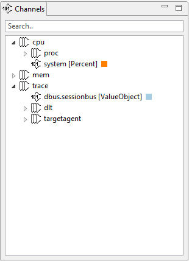

////
Copyright (C) 2018 Elektrobit Automotive GmbH

This program and the accompanying materials are made
available under the terms of the Eclipse Public License 2.0
which is available at https://www.eclipse.org/legal/epl-2.0/

SPDX-License-Identifier: EPL-2.0
////
=== Channels view

You find the channels view at the top left corner of the application window.

It holds a hierarchical list of data channels available for analysis.
Data can originate from generic sources, however in common cases it will look
similar to the structure above. Typical system data contains per-process information
on CPU and memory as well as communication and log data summarized as traces.

Channels will be assigned a color upon first using them for later correlation across views.
