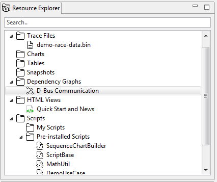
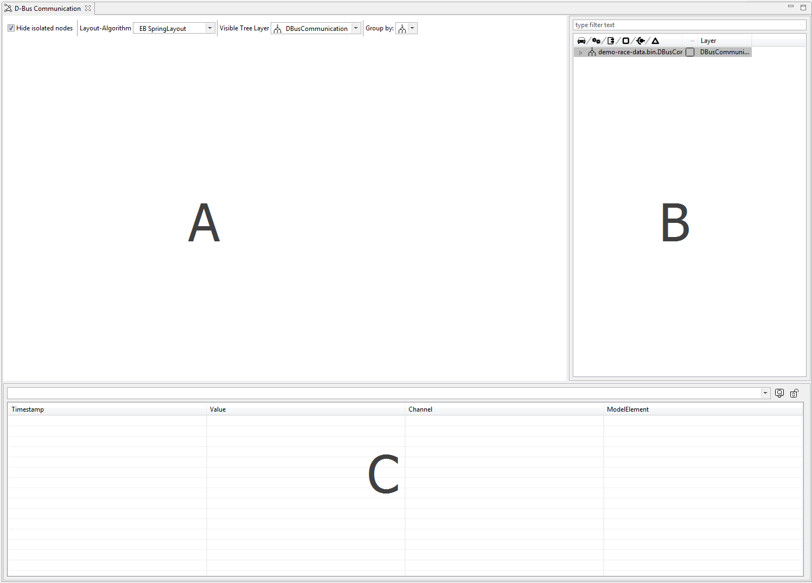
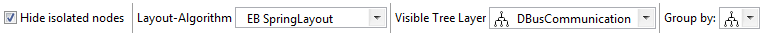
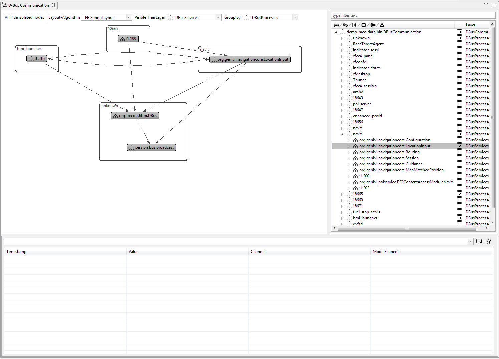
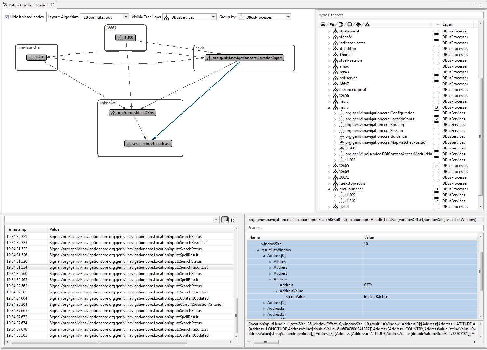

////
Copyright (C) 2018 Elektrobit Automotive GmbH

This program and the accompanying materials are made
available under the terms of the Eclipse Public License 2.0
which is available at https://www.eclipse.org/legal/epl-2.0/

SPDX-License-Identifier: EPL-2.0
////
[[anchor-dependency-graph]]
=== {dependency-graph}

The {dependency-graph} is used to analyze communication data.
Currently D-Bus data is supported.
To open the {dependency-graph}, select *D-Bus Communication* from {dependency-graph}s in the {resource-explorer}.

This opens a view that visualizes a communication graph (A), a component tree (B) and a message table \(C).

To visualize communication, you need to select which level of detail you like to analyze by chosing from the Visible Tree Layer as well as by which attribute you like to group.

Furthermore you need to select which nodes to display.
Selecting the top level node may result in an overloaded view that is hard to grasp.
In most cases it will be better to select one ore two nodes that are of interest and - by right-clicking -
also show all connected nodes.

Once the graph is configured to the desired visual appearance, it can be investigated for communication messages.
Therefore select one ore more (holding kbd:[Ctrl]) edges between the nodes.
The message table will then show all messages that have been recorded for the communication between the two connected nodes.

To also display the decoded payload of the messages, click on the

icon.

