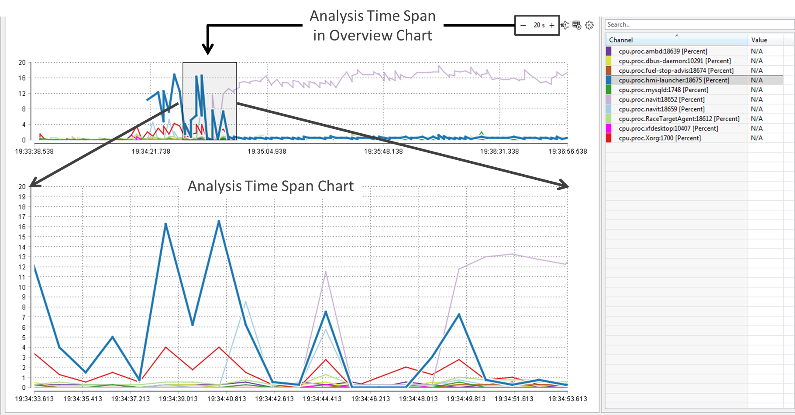

////
Copyright (C) 2018 Elektrobit Automotive GmbH

This program and the accompanying materials are made
available under the terms of the Eclipse Public License 2.0
which is available at https://www.eclipse.org/legal/epl-2.0/

SPDX-License-Identifier: EPL-2.0
////
[[anchor-line-charts]]
=== {chart}s

==== Overview and Analysis time span

Line Charts are used to visualize events from channels with numeric values, typically
runtime data such as memory consumption or cpu load. Every chart is divided into two parts:

* On top the *{overview}* that visualizes all values from the complete recording
* On bottom the *{timespan}* that visualizes the values of a certain time-range.

The length of the {timespan} can be set on the top right menu of the chart.
The {timespan} is also displayed as a grey rectangle within the {overview}.

You can scroll along the overview chart by either typing KEY-LEFT and KEY-RIGHT
or click into a new area within the chart. The analysis time span chart is then
updated automatically.

==== Creating and Deleting Charts

Charts can be created differently:

* By double-clicking a channel or a group of channels (with the same type of events)
* In the context menu of a channel by right-click *Show in Chart*
* Programmatically with a script

The chart name will be created automatically, but can be re-named after typing *F2*.

In case the chart was created with a script, the chart name has to be set as
parameter. See following code snippet from DemoUseCase:

[source, xtend]
----
/**
 * This method creates a chart, that contains all processes which at least
 * consume more than 1.0% of CPU at a certain time.
*/
def createChartForCPULoad() {
	val channels = newArrayList()
	getChannelsByPrefix("cpu.proc.").allEventsFromChannels.groupByTimestamp.forEach[
		channels.addAll(filter[value as Double > 1.0].map[runtimeEventChannel])
	]
	// Create a new chart named 'CPU_Load' and assign some channels to it
	val chart = createOrGetChart("CPU Load", CHART_TYPE.LINE_CHART)
	chart.add(channels.toSet.toList)
}
----

Charts can be deleted in the context menu of the resource explorer by right-clicking *Delete*

==== Managing Channels

More channels can be added to an existing chart by drag and drop them from the channel view into the chart. Only channels of the same type (e.g. *Percent* or *Count*) can be shown in the same chart.
The channels are listed in the channel legend on the right-hand side of the chart. The context menu allows to remove a channel or toggle its visibility (Show/Hide).

The channel legend can be sorted by name or value, in ascending or descending order.
Values are only shown in case a Timemarker is selected, otherwise *N/A* is shown.

==== Working with Time Markers in Line Charts

Please read this <<./index.adoc#anchor-time_markers, section>> first to understand the concept of timemarkers.

Timemarkers can be created or deleted by double-click into the Overview Chart or into the Analysis Time span chart. The name of a time-marker is created automatically, but can be renamed later in the time-marker manager view.

An existing time-marker can be selected with a single click, which is then high-lighted. Selecting a time-marker in the overview chart means that the analysis time span will be re-drawn, where the selected time-marker is then the center of the analysis time-span.
Only the selected time-marker in the overview chart is labeled.

==== Showing Chart Data in a Table

Events visualized in a chart can always be shown in a table by selecting *Show in Table* in the context menu.

==== Preferences

Please refer to <<./index.adoc#anchor-line_chart_settings, line chart settings>> to see how a line chart can be customized.
