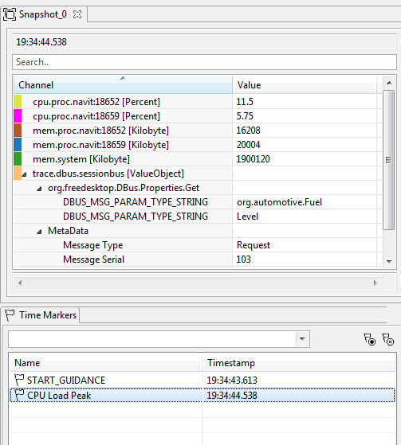

////
Copyright (C) 2018 Elektrobit Automotive GmbH

This program and the accompanying materials are made
available under the terms of the Eclipse Public License 2.0
which is available at https://www.eclipse.org/legal/epl-2.0/

SPDX-License-Identifier: EPL-2.0
////
[[anchor-snapshots]]
=== {snapshot}s

The snapshot view is then useful when you want to display an overview of your
system at a certain timestamp by monitoring significant values.

It is similar to a *watch* window in a programming IDE or debugger where
you can monitor variables at a breakpoint.
You can drag arbitrary channels into a snapshot view. If you are in live mode
then always the last value of the channel is displayed. If you have loaded a file,
then the nearest value to the selected timemarker is displayed.
If no timemarker is selected then the values are marked as N/A (not applicable).

