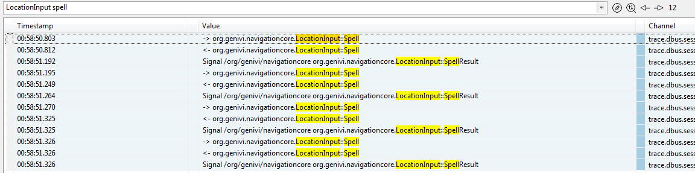
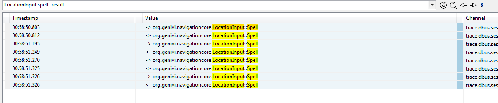
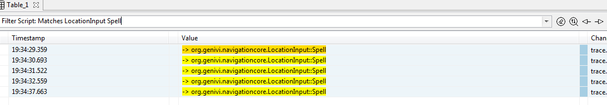
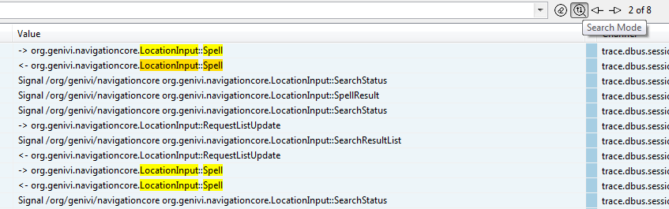
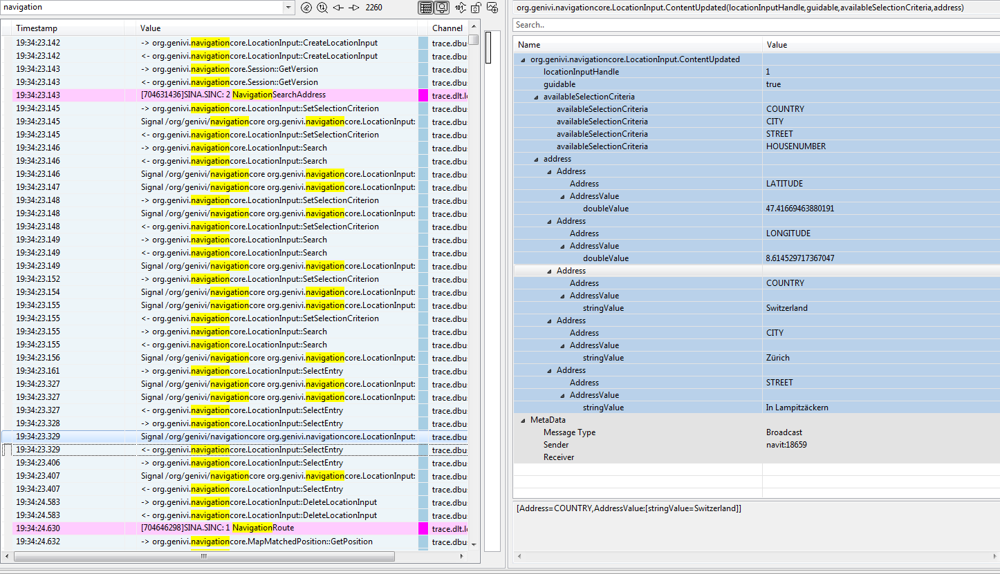

////
Copyright (C) 2018 Elektrobit Automotive GmbH

This program and the accompanying materials are made
available under the terms of the Eclipse Public License 2.0
which is available at https://www.eclipse.org/legal/epl-2.0/

SPDX-License-Identifier: EPL-2.0
////
=== {table}s

==== Purpose

If you are not net familiar with the concepts of <<./index.adoc#anchor-events, events>>
and <<./index.adoc#anchor-channels, channels>> you should read those
chapters first. Tables are used to display any kind of events but typically logging,
tracing or inter-process communication data, anything that is human readable.
Each row in the {table} represents an {event} and its content. The content is divided
into three columns:

* The time stamp, when the {event} was measured
* The value
* The channel which is containing this particular {event}

==== Managing Channels

[[anchor-filter-and-search]]
==== Filtering and searching

{solys} offers two different ways for filtering and searching in tables.
First you can simply type a search phrase into the text-field at the top of the
{table}, second you can implement a script and apply it as a filter to the {table}.

===== Filtering manually

When typing a word into the text-field, the {table} will be filtered with the events, which contain the entered word. When typing multiple words, the search is executesd as an *AND* expression. The search is not case sensitive.

If you want to exclude a certain word you can simply add a '-' ahead of the word.

===== Filtering with scripts

Scripts can easily applied to a {table} as a filter as soon as they are tagged with the annotation @Filter. How this feature works in principle and background information is described <<./index.adoc#anchor-filter_scripts, here>>.

For now just look at the following example to get an idea what could be achieved:

[source, xtend]
----
@Filter(description="Matches LocationInput Spell")
def matches(RuntimeEvent<?> e) {
	e.summary.matches('.*LocationInput.*Spell')	&&
	e.decode.getFirstValue('Message Type').equals('Request')
}
----

The filter *Matches LocationInput Spell* appears in the drop down box on top if
the {table} and is executed as soon as it is selected.

===== Switching between filter and search mode

The only difference between filtering and searching is, that in case of filtering
only those events are displayed which match the filter and in case of search mode
all events are displayed, but the matched events are highlighted. You can toggle
between the two modes with the corresponding button right to the text-field.

[[anchor-decoders]]
==== Decoding complex data

Depending on the channel type events can contain complex data, e.g. structured data
like xml or json. If this is the case, then the structured data is visualized in the
decoder view on the right-hand side within the {table}.

==== Setting channel colors as {table} background

Depending on which data you are looking at, it might be more ergonomical to configure
the {table} to highlight every line using the channel color as the background or
just using the color indicator. Swapping both options is possible by toggling the
icon indicated with a green box.

image::../resources/{table}-highlight.png[link="../resources/{table}-highlight.png"]

==== Working with Time Markers in tables

Please read this <<./index.adoc#anchor-time_markers, section>> first to
understand the concept of timemarkers.

Time markers can be created within the context menu of a {table} in case one or
more events are selected. They will be automatically named and appear immediately
in all tables and charts. They can be managed in the time marker manager view.

==== Running a Script

Whenever a script method is tagged with the annotation *@Execute* and the context
*PRESELECTION* it can be invoked in the context menu of selected tables rows.
The selected events are passed as parameter(s) to the method.

[source, xtend]
----
@Execute(context=PRESELECTION, description="Print to console")
def print(RuntimeEvent<?> event) {
	event.summary.consolePrintln
}
----
