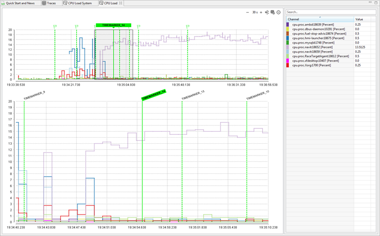
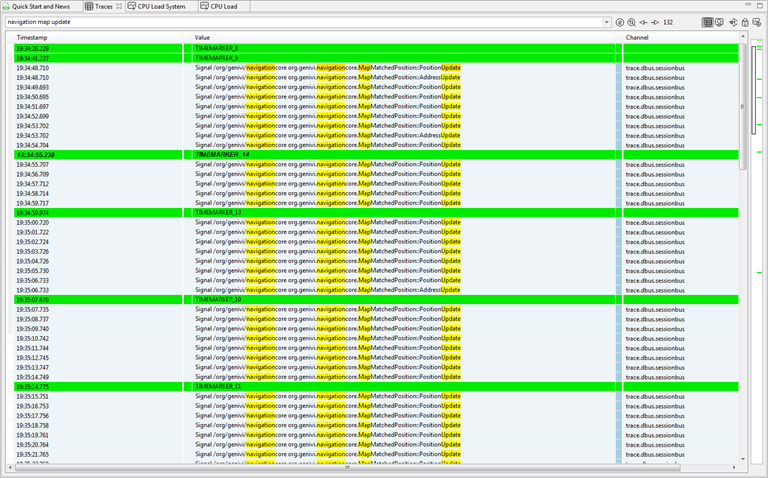
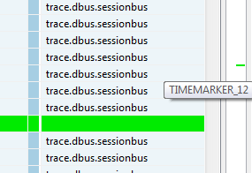
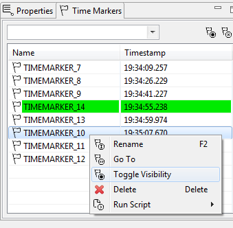

////
Copyright (C) 2018 Elektrobit Automotive GmbH

This program and the accompanying materials are made
available under the terms of the Eclipse Public License 2.0
which is available at https://www.eclipse.org/legal/epl-2.0/

SPDX-License-Identifier: EPL-2.0
////
[[anchor-time-markers]]
=== {timemarker}s

You can make use of the {timemarker} feature in different ways. Typcially there are created manually in
{chart}s or {table}s or by programmatically by {script}s.

==== {timemarker}s in {chart}s

You can create {timemarker}s by double-click into a {chart}, either into the {overview}
or into the {timespan}.
The meaning of the two areas is explained <<./index.adoc#anchor-line-charts, here>>.

On double-click into one of the two {chart} areas a new {timemarker} with a default name is created for you.
At the same time it is highlighted as <<anchor-active_marker, active>> {timemarker}.
If necessary the {timemarker} can be renamed in the <<anchor-manager_view, {timemarker} manager view>>.

In the {overview} only the <<anchor-active_marker, active>> {timemarker} is labeled.
All other {timemarker}s aree displayed with a small flag on top of the view.
In the {timespan} all {timemarker}s are labeled.

Double-clicking an existing {timemarker} will delete it. Single-clicking an existing
{timemarker} will make it an <<anchor-active_marker, active>> {timemarker}.

==== {timemarker}s In {table}s

{timemarker} in {table}s can be created by selecting a {event} and then
clicking *Create Marker* in the context menu. A default name will be assigned.
If necessary the {timemarker} can be renamed in the <<anchor-manager_view, {timemarker} manager view>>.
An existing {timemarker} can be deleted by selecting it and use the corresponding *Delete*
entry in the context menu.
 <<anchor-active_marker, Active>> {timemarker}s are labeled with a *bold* font, all others
 with a plain font.

On the right-hand side of the {table} a _ruler_ is located where all {timemarker}s
are displayed as small green horizontal bars.
As tooltip can display the name of the {timemarker}. When selecting the {timemarker}
it becomes  <<anchor-active_marker, active>>.

==== {timemarker}s with {script}s

With the built-in {script} engine you are also able to create and delete
{timemarker}s or make it <<anchor-active_marker, active>>.

The methods are

* createTimemarker
* removeTimemarker
* removeAllTimemarkers
* jumpTo (which will make the {timemarker}) <<anchor-active_marker, active>>

Follow the <<../tutorials/enhanced_scripting#anchor-enhanced_marker, script tutorial>> for more information.

[[anchor-active_marker]]
==== Active {timemarker}

Active {timemarker}s have a particular role during the analysis. It is centered
across all views, i.e. all {table}s and all {chart}s. Hence you can easily correlate
different events from different views at a certain timestamp with just one click.
In every {chart} the values of the {event}s at the active {timemarker} is displayed
in the legend on the right-hand side.
The same applies for <<./index.adoc#anchor-snapshots, snapshot views>>.

[[anchor-manager_view]]
==== The {timemarker} manager view
You can find {timemarker} view at the bottom left corner of the application
window. It acts as a central view to manage all {timemarker}s, with following functionalities:

* *Rename* an existing {timemarker}
* Make an {timemarker} <<anchor-active_marker, active>> with *Go To*
* *Toggle* the *visibility*: unvisible means the {timemarker} is still there, but not shown in {chart}s or {table}s
* *Delete* an existing {timemarker}
* Run a script in the context of a {timemarker}.
See following <<./index.adoc#anchor-enhanced_html_js, example>>.

.Time marker manager

