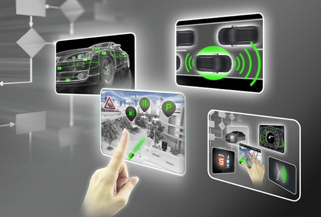

////
Copyright (C) 2018 Elektrobit Automotive GmbH

This program and the accompanying materials are made
available under the terms of the Eclipse Public License 2.0
which is available at https://www.eclipse.org/legal/epl-2.0/

SPDX-License-Identifier: EPL-2.0
////
include::resources/meta.adoc[]

= {solys} User Documentation

== Concepts
include::concepts/index.adoc[]

== Tutorials
include::tutorials/index.adoc[]

== Features
include::features/index.adoc[]

== Glossary
include::intro/glossary.adoc[]

== Legal

=== Contact and Legal Notice
[width="100%",options=",footer"]
|====================
| *Elektrobit Automotive GmbH* +
Am Wolfsmantel 46 +
91058 Erlangen, Germany +
icon:phone[] +49 9131 7701 0 +
icon:fax[] +49 9131 7701 6333 |

*Legal Notice*

This program and the accompanying materials are made
available under the terms of the Eclipse Public License 2.0
which is available at https://www.eclipse.org/legal/epl-2.0/

SPDX-License-Identifier: EPL-2.0

Copyright 2018, Elektrobit Automotive GmbH

All brand names, trademarks and registered trademarks are property of their rightful owners and are used only for description.

|====================

include::intro/oss_list.adoc[]

include::intro/use.adoc[]

include::intro/target_performance.adoc[]

include::intro/system_requirements.adoc[]
