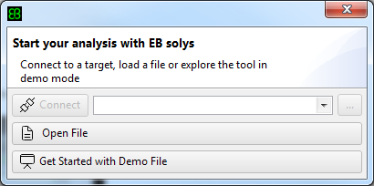
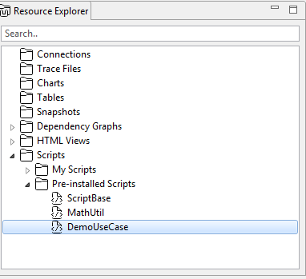

////
Copyright (C) 2018 Elektrobit Automotive GmbH

This program and the accompanying materials are made
available under the terms of the Eclipse Public License 2.0
which is available at https://www.eclipse.org/legal/epl-2.0/

SPDX-License-Identifier: EPL-2.0
////
[[anchor-demo-file]]
=== Working with the demo file

==== Scope and content

If you are new to {solys} it is highly recommended that you start with the
integrated demo file in order to explore its features and capabilities.
The demo file contains a recorded log from the navigation reference application
of the Location-based Services Expert Group of the GENIVI alliance.
This reference application is Linux based and is using d-bus as IPC framework
and DLT as logging framework. Thus the demo file contains following kind of
runtime events:

* Linux resource information such as cpu load and memory consumption of all processes
* d-bus IPC messages
* DLT application logs

In order to understand the examples and tutorials of this document you need to know the actions that have been performed while recording the demo file:

* Starting the navigation application
* Entering a destination
* Starting a route calculation to the given destination
* Starting a guidance
* Following the route in taxi mode
* Showing the route in the map viewer

TIP: The demo file was recorded with the {solys} {targetagent}. If you want to record
your own log files on a Linux based system then follow these instructions.

==== Get Started with the demo file

After launching {solys} you have a direct short-cut to start with the demo file:

Two things are happening when starting with the demo file: First the demo file is loaded (that is containing all data described above) and then the demo script is executed.

The demo script has the purpose of creating some resources like tables, charts and time markers automatically on the given data in the logfile.

If you want to dig into the code of the script you can open it here:

TIP: The powerful capabilities of the built-in script engine is decribed here.

Following resources have been created by the script:

* A table named *Traces* that contains all kind of application traces and ipc messages
* A chart named *CPU Load* that shows the cpu load series of all processes, that have at least consumed more than 1% cpu during the recording
* A chart named *CPU Load System* that the complete cpu load of all processes
* A time marker named *START GUIDANCE* that refers to the time-stamp when the guidance was started
* A time marker named *CPU Load Peak* that refers to the time-stamp when the system had its highest cpu load
