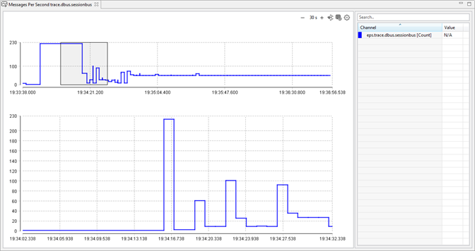
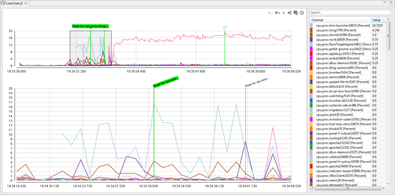
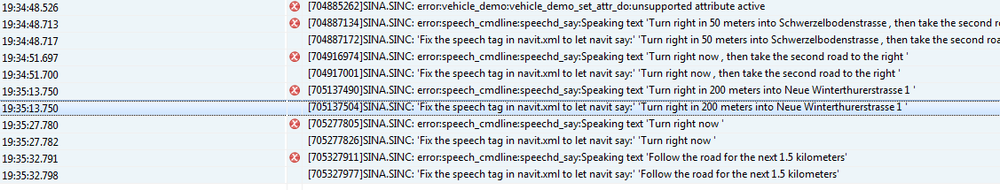
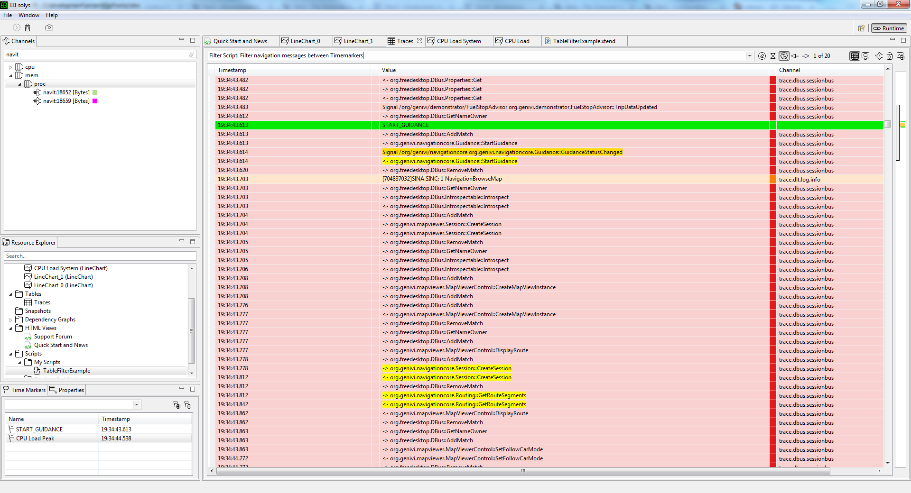
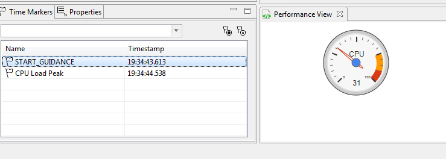
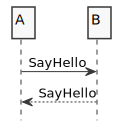
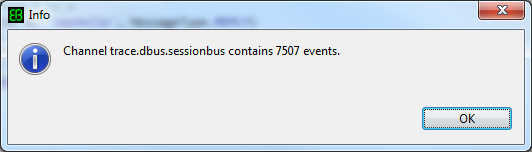

////
Copyright (C) 2018 Elektrobit Automotive GmbH

This program and the accompanying materials are made
available under the terms of the Eclipse Public License 2.0
which is available at https://www.eclipse.org/legal/epl-2.0/

SPDX-License-Identifier: EPL-2.0
////
:use-case: Use Case
:code: The script code
:explained: The code explained
:execute: Execute the script
:result: The result

[[anchor-using_the_api]]
=== Enhanced scripting examples

This chapter is meant to give an overview of the scripting capabilities by different use-cases. It is recommended to try out these examples as an exercise to understand the concepts.
The complete script API is described here.

All examples can be tried with the built-in demo file. Therefore it is recommended to read the corresponding <<./index.adoc#anchor-demo-file,chapter>> first.
To try the code snippets in this tutorials you just need to <<./index.adoc#anchor-hello_world, create a new script>> and copy+paste the code into it and execute the scripts.

TIP: If you copy+paste subsequent examples to existing scripts some of the used classes might not be already
imported, which leads to an syntax error in the editor. Just type CTRL-SHIFT-O to resolve the missing dependencies.

==== Channels and Events

===== Creating a new channel

*{use-case}*

Determine the events per seconds of any channel, store the result in a new channel and show
its values as a time-series in a line chart.

*{code}*

[source, xtend]
----
val SECOND_AS_MICROSECONDS = 1000000 // (1)

@Execute(context=ExecutionContext.PRESELECTION, description="Determines the events per second for the given channel") // (2)
def eventsPerSecond(RuntimeEventChannel<?> channel) {
  val mpsChannel = createOrGetChannel('eps.' + channel.name, Unit.COUNT, '') // (3)
  channel.events.groupBy[timestamp / SECOND_AS_MICROSECONDS].forEach [ts, list| // (4)
    mpsChannel.addEvent(ts * SECOND_AS_MICROSECONDS, list.size as long) // (5)
  ]
  createOrGetChart('Messages Per Second ' + channel.name, CHART_TYPE.LINE_CHART).add(mpsChannel) // (6)
}
----

*{explained}*
====
. Annotate your method with  @Execute(context=ExecutionContext.PRESELECTION)
. The timestamp of an event is stored in micro-seconds, means one second is 1000000 micro-seconds.
The variable can be declared inside or outside the script method, depending if you need the
value in other methods too
. Create a new channel for storing the events per second data
. Get the events from the given channel and group them by events per second
. Add the number of messages per second to the new channel
. Create a new line chart and add the channel
====

*{execute}*
====
. Open the demo file if not yet done
. Add the code snippet to an existing script or create a new one
. Select a channel of your choice in the channel view
. Execute the script with the context menu while right-click the channel
====

*{result}*

Follwing chart is created when executing the script in the context of the channel
'trace.dbus.sessionbus'

===== Working with decoded events

*{use-case}*

Assume you want to create a Time Marker when a certain status of your system has changed.
The status information itself is part of an encoded payload.

*{code}*

[source, xtend]
----
@Execute(context=ExecutionContext.GLOBAL, description="Create Timemarkers when Guidance Status had changed") // (1)
def guidanceStatusChanged() {
  getChannel('trace.dbus.sessionbus').events // (2)
    .filter[summary.contains('GetGuidanceStatus')] // (3)
      .map[decode] // (4)
      .filter[getFirstValue('Message Type').equals('Response')] // (5)
      .reduce[p1, p2 |
        if (!p1.getFirstValue('guidanceStatus').equals(p2.getFirstValue('guidanceStatus')))
          createTimemarker(p2.runtimeEvent.timestamp, "Guidance Status Changed")
        p2] // (6)
}
----

*{explained}*
====
. Annotate your method with  @Execute(context=ExecutionContext.GLOBAL)
. Get the channel with the events that contain the status data
. Filter the events which contain the status data
. Decode the binary payload into a structured tree
. Filter only response messages
. Iterate through the list of events and compare two consecutive events. If the value
(means the status) has changed, then create a new Time Marker.
====

*{execute}*
====
. Open the demo file if not yet done
. Add the code snippet to an existing script or create a new one
. Go to the script folder in the resource explorer and look for your script
. Execute it in the context menu: 'Run as...'
====

[[anchor-enhanced_marker]]
==== Timemarker

*{use-case}*

Create a Timemarker at the position where the system reached its cpu load peak.
The code snippet is part of the DemoUseCase in the pre-installed script folder.

*{code}*

[source, xtend]
----
@Execute(context=ExecutionContext.GLOBAL, description="Create Time Markers for cpu peaks") // (1)
def createMarkerForCPUSystemPeaks() {
  getChannelsByPrefix("cpu.proc").forEach[ // (2)
    val max = events.sortBy[value as Double].last // (3)
    if(max.value as Double > 3.0) { // (4)
      createTimemarker(max.timestamp, 'Peak for '+name) // (5)
    }
  ]
}
----

*{explained}*
====
. Annotate your method with  @Execute(context=ExecutionContext.GLOBAL)
. Get all channels the start with the prefix 'cpu.proc'
. Get the maximum value of all events within a channel
. Filter channels with maximum value > 3.0%
. Create a Time Marker at that position
====

*{execute}*
====
. Open the demo file if not yet done
. Add the code snippet to an existing script or create a new one
. Go to the script folder in the resource explorer and look for your script
. Execute it in the context menu: 'Run as...'
====

*{result}*

Open a chart with all 'cpu.proc' channels and you can see the created Time Markers
for the processes, which had a cpu load peak with at least > 3.0%.

==== Tables

Here are some examples how the script API can be used in terms of working with tables.

===== Creating a table

*{use-case}*

Assume you want to create a table for all channels which starts with the prefix 'trace'.

TIP: The following code snippet is also part of the DemoUseCase in the pre-installed script folder.

*{code}*

[source, xtend]
----
/**
 * This method will create a table that contains events from all kinds of trace channels.
 */
 @Execute(context=ExecutionContext.GLOBAL, description="Create a table for all trace channels") // (1)
def createTraceTables() {
  createOrGetTable("Traces") // (2)
    .add(getChannelsByPrefix('trace')) // (3)
}
----

*{explained}*
====
. Annotate your method with  @Execute(context=ExecutionContext.GLOBAL)
. Create a new table called 'Traces'
. Add all channels to the created table, which starts with 'trace'
====

*{execute}*
====
. Open the demo file if not yet done
. Add the code snippet to an existing script or create a new one
. Go to the script folder in the resource explorer and look for your script
. Execute it in the context menu: 'Run as...'
. A table will be created with the name 'Traces'
====

===== Tagging events

If for a certain reason you have the need to add extra information to an event you can make use of the tagging functionality.
You can add a tagging type (ERROR or WARNING) together with a description.
In tables tagged events are highlighted with a tag icon.

*{use-case}*

Tag all DLT events which are containing the word "error" in the summary.

*{code}*

[source, xtend]
----
@Execute(context=ExecutionContext.GLOBAL, description="Tag DLT events, that contain 'error' within the message") // (1)
def taggingEvents() {
  getChannelsByPrefix('trace.dlt').allEventsFromChannels. // (2)
    filter[summary.contains('error')]. // (3)
    forEach[setTag(RuntimeEventTag.ERROR, 'an error occured')] // (4)
}
----

*{explained}*
====
. Annotate your method with  @Execute(context=ExecutionContext.GLOBAL)
. Get all events from all dlt channels
. Filter events that contains the word 'error'
. Set a tag (Type ERROR together wit a description) for all these events
====

*{execute}*
====
. Open the demo file if not yet done
. Add the code snippet to an existing script or create a new one
. Open a table with all dlt channles
. Go to the script folder in the resource explorer and look for your script
. Execute it in the context menu: 'Run as...'
. The events in the table will be tagged with an error icon
====

*{result}*

===== Filtering events

If you need to filter events in a more comprehensive way than just searching for
particular words in the trace message you can implement a filter script.

Every script annotated with *@Filter* will appear in the search/filter choice box of a table and can be executed directly from there. Events that matches the filter will be highlighted in yellow color:

*{use-case}*

Filter all navigaton events between two specific Time Markers

*{code}*

[source, xtend]
----
@Filter(description="Filter navigation messages between Timemarkers") // (1)
def matches(RuntimeEvent<?> e) {
	e.timestamp > getFirstTimemarker('START_GUIDANCE').timestamp && // (2)
	e.timestamp < getFirstTimemarker('CPU Load Peak').timestamp &&  // (3)
	e.summary.contains('navigation') // (4)
}
----

*{explained}*
====
. Annoate your method with @Filter
. Check if the event occured after the Time Marker 'START_GUIDANCE'
. Check if the event occured before the Time Marker 'CPU Load Peak'
. Check if the event contains the word 'navigation'
====

*{execute}*
====
. Open the demo file if not yet done
. Add the code snippet to an existing script or create a new one
. Open a table with all trace channels
. Select your filter in the drop down box on the top of the table
. The events in the table which match the filter rule are highlighted
====

*{result}*

==== Charts

[source, xtend]
----
/**
 * This method will create a chart for the CPU load of the overall system (summarized all singular process cpu values).
 */
def createChartForCPULoadSystem() {
  createOrGetChart("CPU Load System", CHART_TYPE.LINE_CHART).add(getChannel("cpu.system"))
}
----

[[anchor-enhanced_html_js]]
==== HTML and JavaScript

The {solys} script API allows the user to create own HTML files, which are then displayed by the internal browser engine.
There are methods for:

* creating a new or getting an existing html file
* assigning the (html) content to the file
* passing a java-script call from {solys} into the HTML file
* calling back a {solys} function from within java-script code

WARNING: {solys} does not check if the created HTML is syntactically valid.
You as a script developer are reponsible to generate correct HTML code.

*{use-case}*

Show the CPU value at a given timemarker in a google charts gauge view

*{code}*

[source, xtend]
----
@Execute(context=ExecutionContext.PRESELECTION, description="Show Timemarker in Google Charts Gauge") // (1)
def execute(TimeMarker timeMarker) { // (2)
  val performanceView = createOrGetHtmlView('Performance View') // (3)
  performanceView.content =
    toHTML( (getChannel('cpu.system').getEventAt(timeMarker).value as Double).intValue).toString // (4)
}

/**
* This method simply creates a HTML page which is rendered with the internal Browser
* The data will be updated with java-script function updatePerformance, which is invoked within internal xtend function updatePerformanceData
*/
def toHTML(int cpuValue) {
'''
<html>
  <head>
   
   
  </head>
  <body>
  

  </body>
</html>
'''
}
----

*{explained}*
====
. Annotate your method with  @Execute(context=ExecutionContext.PRESELECTION)
. Handover the timemarker as parameter
. Create a new HTML View and name it 'Performance View'
. Retrieve the value of cpu system at the given timemarker and generate html code
====

*{execute}*
====
. Open the demo file if not yet done
. Add the code snippet to an existing script or create a new one
. Select a Time Marker in the Time Marker Manager View
. Execute the script with the context menu while right-click the channel
====

*{result}*

==== Sequence Charts

A message sequence chart is an interaction diagram with the purpose to emphasize the flow of control and data between different software components. It shows interactions arranged in a time sequence.

{solys} offers a generic API for sequence diagrams in order to

* create Lifelines
* create Messages between the Lifelines
* convert the sequence into Plant UML language
* create the sequence diagram as picture (svg and png is supported)
* embed the diagram into a HTML page

Since the creation of a message sequence depends on the underlying trace format and content the user needs to implement a short mapping between the trace data and sequence.

*{use-case}*

*{code}*

[source, xtend]
----
@Execute(context=ExecutionContext.GLOBAL, description="Create a squence chart") // (1)
def sequenceChartExample() {
  val PICTURE = 'example_sequence.svg' // (2)
  val SequenceChartBuilder chartBuilder = new SequenceChartBuilder('Sequence Chart') // (3)
  val a = chartBuilder.addLifeline('A') // (4)
  val b = chartBuilder.addLifeline('B')
  chartBuilder.addMessage(a, b, 'SayHello', MessageType.REQUEST) // (5)
  chartBuilder.addMessage(b, a, 'SayHello', MessageType.REPLY) // (6)
  if (plantUmlToSVG(chartBuilder.toPlantUML, PICTURE)) { // (7)
    createOrGetHtmlView("Example Sequence Chart").content = // (8)
    '''
      <html><object data="«PICTURE»" type="image/svg+xml"/></html>
    '''
  }
}
----

*{explained}*

. Annotate your method with  @Execute(context=ExecutionContext.PRESELECTION)
. Define a name of the to be created sequence chart
. Get an instance of the sequence chart builder API
. Create two lifelines A and B
. Add a message from A to B
. And back from B to A
. Convert your sequence into a Plant UML text document and render a diagram
. Show the diagram embedded within a HTML View

TIP: A more meaningful example is located under Pre-installed Scripts /
DbusSequenceChartGenerator.

*{execute}*
====
. Open the demo file if not yet done
. Add the code snippet to an existing script or create a new one
. Go to the script folder in the resource explorer and look for your script
. Execute it in the context menu: 'Run as...'
====

*{result}*

==== Message Boxes

There are three different user dialogs available, that can be invoked from within a script

* messageBoxInfo
* messageBoxWarning
* messageBoxError

*{use-case}*

Determine the number of events in a channel and show them in an info box

*{code}*

[source, xtend]
----
@Execute(context=ExecutionContext.PRESELECTION, description="Show number of messages") // (1)
def showNumberOfMessages(RuntimeEventChannel<?> channel) { // (2)
  messageBoxInfo('Channel '+channel.name+ ' contains '+channel.events.size + ' events.') // (3)
}
----

*{explained}*
====
. Annotate your method with  @Execute(context=ExecutionContext.PRESELECTION)
. Handover a channel as parameter
. Determine the number of events in that channel and display it in a message box
====

*{execute}*
====
. Open the demo file if not yet done
. Add the code snippet to an existing script or create a new one
. Select a channel of your choice in the channel view
. Execute the script with the context menu while right-click the channel
====

*{result}*

==== Measuring KPIs

{solys} provides a generic way to store measured KPIs of your system.
The feature is especially used in conjunction with the {solys} Auto mode
where it can be used in a batch mode.
Therefore {solys} Auto needs to be embedded into any kind of continuous integration
enviroment with a supplementary reporting dashboard.

TIP: If required {solys} can be shipped in the Auto variant together with a reporting
enviroment containing Jenkins, Grafana and InfluxDB or ElasticSearch.
Please contact sales@elektrobit.com for further information.

This chapter is only about measuring and storing KPIs, not about reporting.

*{use-case}*

Measure the average cpu load of your overall system during the entire life-cycle.
Store this information together with some meta data in a json-formatted file.
The content of the file can be post-processed by any reporting framework.

*{code}*

[source, xtend]
----
@Execute(context=ExecutionContext.GLOBAL, description="") // (1)
def measureKPIExample() {
  val avgCPU = getChannel('cpu.system').events.map[value as Double].averageDouble // (2)
  val builder = new KPIResultBuilder // (3)
  .addMetaData("date", new SimpleDateFormat("yyyy-MM-dd HH:mm:ss").format(new Date)) // (4)
  .addMetaData("test_person", System.getProperty("user.name")) // (5)
  .addMetaData('sw_version', 'Version 1.0.0') // (6)
  .addMeasuredItem('average_cpu', ''+avgCPU, 'percent') // (7)
  KPIResultFileWriter.writeToFile("./my_kpi.json", builder.build) // (8)
}
----

*{explained}*
====
. Annotate your method with  @Execute(context=ExecutionContext.GLOBAL)
. Determine the KPI you want to measure (in that case the average cpu load of the overall system)
. Get access to the KPI Builder API
. Add the current date as meta data
. Add the tester name as meta data
. Add the software version as meta data
. Add the KPI as measured item
. Store the KPI in a json formatted file for further processing
====

*{execute}*
====
. Open the demo file if not yet done
. Add the code snippet to an existing script or create a new one
. Go to the script folder in the resource explorer and look for your script
. Execute it in the context menu: 'Run as...'
====

*{result}*

When invoking the script a file named my_kpi.json will be created with following content.

[source, json]
----
{
  "metaDataItems": {
    "date": "2017-02-22 16:13:03",
    "test_person": "testuser",
    "SW Version": "Version 1.0.0"
  },
  "errorMessages": [],
  "measuredItems": [
    {
      "name": "average_cpu",
      "value": "13.824987309644671",
      "unit": "percent"
    }
  ]
}
----
