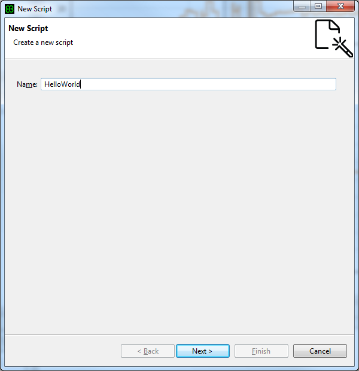
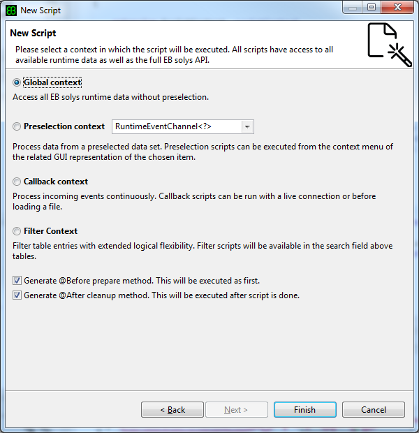
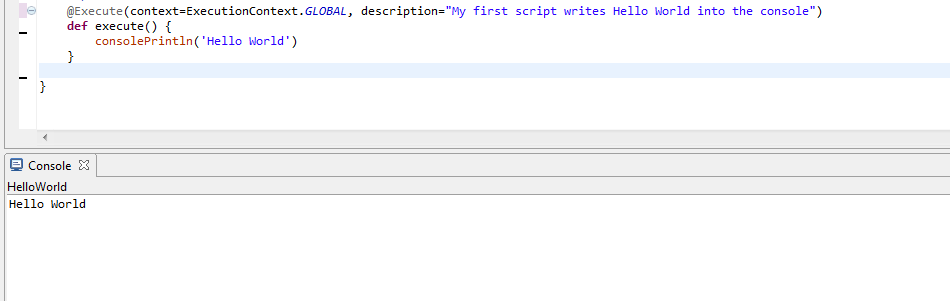

////
Copyright (C) 2018 Elektrobit Automotive GmbH

This program and the accompanying materials are made
available under the terms of the Eclipse Public License 2.0
which is available at https://www.eclipse.org/legal/epl-2.0/

SPDX-License-Identifier: EPL-2.0
////
[[anchor-hello_world]]
=== Writing a Hello World Script

The {solys} scripting language, the concepts and the APIs are described
<<./index.adoc#anchor-scripting, here>>.

But usually the best way learning the prinicples of a new programming language
is to start with a simple Hello World program. So let's start with that at first:

==== Creating a new script

Go to the File Menu or the Resource Explorer and select New -> New Script and
give the script the name *HelloWorld*.
You don't need to add a file extension, since it will be auto-completed with
.xtend. Then click *Next*.

==== Selecting an execution context

A new window appears, where you can select the
<<./index.adoc#anchor-execution_context, execution context>> and some
<<./index.adoc#anchor-lifecycle, lifecycle>> methods (which are optional).
Just follow the links for further information. It is not needed to understand the
simple Hello World example, but is mandatory to understand the overall concept
behind srcipting with {solys}.

For the moment just select *Global context* and proceed with *Finish*.

==== The generated script skeleton

After leaving the wizard with *Finish* a new script called *HelloWorld.xtend* is
created in the folder *Srcipts/My Scripts* and opened in the editor. A basic code
skeleton of your script is created automatically for you. It contains a constructor,
that will give you access to the {solys} script API. Therefore the constructor
*MUST NOT* be touched. Additionally the skeleton of your script method will be
generated. Methods with the annotation @Execute are automatically recognized
from {solys} and can be executed in the GUI.
You will also find methods which are annotated with @BeforeScript and @AfterScript.
This is an enhanced mechanism to control the life cycle of the script. Details
about the lifecycle of the script are explained
<<./index.adoc#anchor-lifecycle,here>>.

[source, xtend]
----
class HelloWorld
{
  extension ScriptContext _scriptContext
  extension ScriptBase _scriptBase

  new (ScriptContext scriptContext) {
    _scriptContext = scriptContext
    _scriptBase = new ScriptBase(_scriptContext)
  }

  @BeforeScript
  def setupScript() {
    // Your setup code
  }

  /**
   * Add a meaningful content to the description tag to describe the feature, which is executed by this script
   * The content of the description tag will be used in all UI widgets where the script can be invoked
   * If the content is empty, then the classname.methodname will be used instead
   */
  @Execute(context=ExecutionContext.GLOBAL, description="")
  def execute() {
    // Your script code
  }

  @AfterScript
  def cleanup() {
    // Your cleanup code
  }
}
----

==== Adding a console prompt to your script

Now you can add a simple expression into the execute method body. Since we want
to print a "Hello World" into the console we are calling the corresponding method
*consolePrintln*. Enter also a meaningful description.

[source, xtend]
----
@Execute(context=ExecutionContext.GLOBAL, description="My first script writes Hello World into the console")
def execute() {
  consolePrintln('Hello World')
}
----

==== Running the script

Navigate to the *Scripts/My Scripts/HelloWorld* and execute the script with the
description "*My first script writes Hello World into the console*"

As usual for a "Hello World" example we have picked the most simple use-case.
Printing a string into the console. The console will be opened automatically in
{solys}.

Continue <<./index.adoc#anchor-using_the_api, here>> for more
elaborate scripts.
