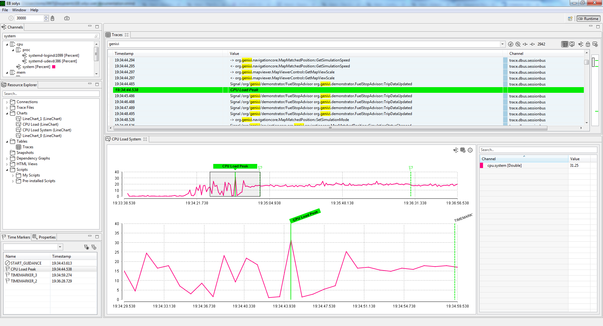

////
Copyright (C) 2018 Elektrobit Automotive GmbH

This program and the accompanying materials are made
available under the terms of the Eclipse Public License 2.0
which is available at https://www.eclipse.org/legal/epl-2.0/

SPDX-License-Identifier: EPL-2.0
////
[[anchor-time_markers]]
=== {timemarker}s

{timemarker}s are used to correlate <<./index.adoc#anchor-events, runtime events>>
across different views. They can be created manually from the GUI or from a script
and always have a timestamp and a name.

Assume you want to observe your logs in the context of the moment where the cpu
load of your systems reaches its peak. You would just need to open a CPU chart
and double-click the position with the peak value. The table with the logs will
automtically be centered to the newly created timemarker. You can also give the
marker a reasonable name.

The other way around you be may be interested in the impacts of your system
resources in case a certain event has happened.
You either can open the table with the logs and search for the event and create
a time marker in the context-menue of a table row or you can implement a script,
that does it automatically for you.

Refer to <<./index.adoc#anchor-time-markers, this section>> for the
entire time marker feature list.

Refer to <<./index.adoc#anchor-scripting, this section>> for a detailed
information regarding scripts.
